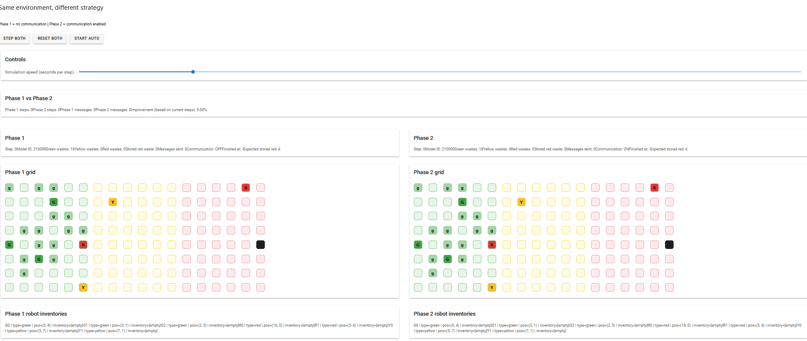
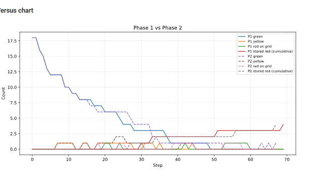

# Mission Robot MAS 2026 --- (Version V1)

Guillaume PORET
Chriss Boshra
Groupe 30

## 1. Vue d’ensemble du projet

Ce projet implémente un système multi-agents dans lequel des robots opèrent dans un environnement hostile afin de collecter, transformer et transporter des déchets radioactifs.

L’environnement est divisé en trois zones :

- z1 : faible radioactivité, contient les déchets verts initiaux
- z2 : radioactivité moyenne
- z3 : forte radioactivité, inclut la zone de stockage

Chaîne de transformation des déchets :

vert → jaune → rouge → stockage

Les robots sont spécialisés :

- Robots verts : collectent les déchets verts et les transforment en jaunes
- Robots jaunes : collectent les déchets jaunes et les transforment en rouges
- Robots rouges : transportent les déchets rouges vers la zone de stockage

------------------------------------------------------------------------

## 2. Structure du projet

- agents.py : comportements des robots
- model.py : environnement et logique de simulation
- objects.py : objets passifs
- server.py : visualisation
- benchmark.py : évaluation des performances
- run.py : instructions de lancement

------------------------------------------------------------------------

## 3. Conception du modèle

### Environnement

L’environnement est une grille 2D définie par une largeur et une hauteur.

Les zones sont déterminées par l’indice de colonne :

- z1 : de x = 0 à z1_end
- z2 : de z1_end + 1 à z2_end
- z3 : colonnes restantes

Chaque cellule contient :
- un niveau de radioactivité
- éventuellement un déchet
- éventuellement des robots

### Paramètres

Les paramètres principaux sont :

- width, height : taille de la grille
- n_green_robots, n_yellow_robots, n_red_robots : nombre d’agents
- seed : graine aléatoire
- communication_enabled : active ou désactive la communication
- max_steps : limite de simulation
- n_initial_green_wastes : nombre de déchets initiaux

### Transformation des déchets

- 2 verts → 1 jaune
- 2 jaunes → 1 rouge
- rouge → stocké dans la zone de stockage

### Condition d’arrêt

La simulation s’arrête dans deux cas principaux :

1. l’objectif de la mission est atteint :

   `stored_red_waste >= expected_stored_red`

2. aucun progrès supplémentaire n’est possible, ou le nombre maximal de pas est atteint.

La quantité cible de déchets finaux stockés est calculée comme suit :

`expected_stored_red = initial_green_wastes // 4`

Cela provient de la chaîne de transformation implémentée dans le modèle :

- 2 déchets verts -> 1 déchet jaune
- 2 déchets jaunes -> 1 déchet rouge
- 1 déchet rouge -> stocké dans la zone de stockage

La condition d’arrêt ne se limite pas au critère de stockage final. Le modèle vérifie également si un progrès significatif est encore possible en inspectant :

- les déchets rouges déjà présents sur la grille ou dans les inventaires des robots
- les déchets jaunes encore disponibles
- les déchets verts encore disponibles
- si certains robots peuvent encore effectuer une transformation

Pour la version avec communication, le modèle inclut une courte fenêtre de tolérance sans progrès via `deadlock_patience`. Cela est nécessaire car les agents peuvent se coordonner et se débloquer grâce à la communication.

En particulier, les agents peuvent échanger des déchets intermédiaires via une zone tampon. Lorsque deux robots possèdent chacun un seul objet qui ne peut pas être transformé localement, ils peuvent se coordonner : un robot dépose son objet sur le buffer, et l’autre le récupère pour compléter une transformation. Ce mécanisme coopératif peut nécessiter plusieurs étapes sans progrès immédiat (pas de transformation ni de stockage), d’où la nécessité d’une tolérance avant d’arrêter la simulation.

Pour la version sans communication, cette tolérance est désactivée (`deadlock_patience = 0`). Comme les agents ne peuvent ni partager d’informations ni coordonner des échanges via le buffer, aucune stratégie de récupération n’existe une fois le système bloqué. La simulation s’arrête donc dès qu’aucun progrès supplémentaire n’est possible dans l’état courant.

Lorsque la simulation se termine à cause d’un tel blocage (plus aucun progrès atteignable), le nombre final de pas est fixé à `max_steps` afin de rendre les résultats comparables entre les exécutions.

------------------------------------------------------------------------

## 4. Conception des agents

### Architecture des agents

Chaque agent suit une boucle :

1. Perception  
2. Mise à jour des connaissances  
3. Délibération  
4. Exécution de l’action  

Les agents maintiennent une structure de connaissances locale incluant :

- position actuelle  
- inventaire  
- cellules visibles  
- déchets connus  
- cibles partagées  
- revendications (claims)  
- états des robots  

------------------------------------------------------------------------

### Agent vert

Responsabilités :

- collecter les déchets verts  
- transformer en jaunes  
- déplacer les déchets jaunes vers la frontière de z1  

Comportement :

- ramassage local si un déchet est présent  
- transformation lorsqu’il possède deux éléments  
- stratégie de patrouille dans z1 avec un mouvement structuré  

------------------------------------------------------------------------

### Agent jaune

Responsabilités :

- collecter les déchets jaunes  
- transformer en rouges  
- déplacer les déchets rouges vers z3  

Comportement :

- priorise les cibles connues  
- mouvement basé sur la frontière entre zones  
- transformation lorsqu’il possède deux éléments  

------------------------------------------------------------------------

### Agent rouge

Responsabilités :

- collecter les déchets rouges  
- transporter vers la zone de stockage  

Comportement :

- déplacement direct vers la zone de stockage  
- aucune transformation  

------------------------------------------------------------------------

## 5. Système de communication

La communication est contrôlée par un paramètre booléen (`communication_enabled`).

Lorsqu’elle est activée, les agents ne diffusent pas globalement sans structure. La communication est organisée par type de déchet et type de robot, et chaque agent ne reçoit que les informations pertinentes pour son rôle.

---

### Communication filtrée par type

La communication n’est ni globale ni symétrique entre tous les agents. Elle est structurée à la fois par type de robot et par la chaîne de transformation.

Chaque agent partage des informations sur :

- son type de déchet cible (tâche principale)  
- le type de déchet suivant dans la chaîne de transformation (pour aider les agents en aval)  

Plus précisément :

- agents verts :  
  - partagent des informations sur les déchets verts  
  - signalent aussi les déchets jaunes  

- agents jaunes :  
  - partagent des informations sur les déchets jaunes  
  - signalent aussi les déchets rouges  

- agents rouges :  
  - se concentrent uniquement sur les déchets rouges  

Cependant, au moment de la perception, chaque agent ne reçoit que les informations pertinentes pour son type :

- agents verts → déchets verts  
- agents jaunes → déchets jaunes  
- agents rouges → déchets rouges  

Flux d’information :

vert → jaune → rouge  

---

### Carte partagée (rapports de déchets)

Les agents publient des observations sur les déchets visibles.

Chaque rapport contient :

- type de déchet  
- position  
- distance (depuis l’agent)  
- priorité  
- timestamp (last_seen)  
- id du robot  

Structure :

shared_map[waste_type][position] → report  

Les rapports sont mis à jour en continu et supprimés après une durée de vie (TTL).

---

### Claims (éviter les conflits)

Les agents peuvent réserver une cible avant de s’y déplacer.

Chaque claim contient :

- id du robot  
- timestamp  

claims[waste_type][position] → {robot_id, step}

Règles :

- un robot évite les cibles déjà revendiquées  
- les claims expirent après un certain nombre de pas  
- ils sont libérés si la ressource disparaît  

---

### Partage d’état des robots

Les agents diffusent :

- position  
- nombre d’objets  

shared_robot_state[robot_type][robot_id] → état  

---

### Échange coopératif via buffer

Un mécanisme de coordination est implémenté via une position buffer située aux frontières des zones.

Déclenchement :

- un robot possède exactement un objet  
- aucun objectif compatible connu  
- communication activée  

Processus :

1. identification d’un partenaire  
2. tri par id  
3. dépôt sur le buffer  
4. récupération  
5. transformation  

Contraintes :

- un seul objet sur le buffer  
- gestion de claims  
- attente si occupé  

---

### Coût des messages

Chaque communication incrémente :

"message_count"

------------------------------------------------------------------------

## 6. Conception du benchmark

Les simulations sont exécutées sous deux configurations :

- Phase 1 : communication désactivée  
- Phase 2 : communication activée  

Les deux phases utilisent les mêmes graines et conditions initiales.

Les simulations sont réalisées avec les paramètres suivants :
width=18, height=8, 3 robots verts, 2 jaunes, 2 rouges, max_steps=150.

Un total de 30 simulations indépendantes est effectué pour chaque phase.

Mesures collectées :

- nombre de pas  
- déchets rouges stockés  
- taux de complétion  
- efficacité  
- nombre de messages  
- taux de succès  

------------------------------------------------------------------------

## 7. Résultats

| Metric              | Phase 1 (sans communication) | Phase 2 (avec communication) |
|--------------------|-----------------------------|------------------------------|
| Average steps      | 92.77                       | 73.80                        |
| Stored red waste   | 3.57                        | 3.83                         |
| Completion ratio   | 0.9189                      | 0.9933                       |
| Efficiency         | 0.045204                    | 0.053682                     |
| Success rate       | 70%                         | 96.7%                        |
| Messages           | 0                           | 647.83                       |

---

### Description des métriques

- **Average steps**  
  Nombre moyen de pas avant arrêt (succès ou deadlock)

- **Stored red waste**  
  Nombre moyen de déchets rouges stockés  

- **Completion ratio**  
  `stocké / attendu`  

- **Efficiency**  
  `stocké / pas`  

- **Success rate**  
  Pourcentage de réussite  

- **Messages**  
  Nombre moyen de messages  

---

### Observations

- La communication améliore fortement les performances  
- Moins de blocages  
- Meilleure efficacité globale  
- Coût en messages compensé  

------------------------------------------------------------------------

## 8. Visualisation de la simulation (Phase 1 vs Phase 2)

Les deux simulations sont exécutées en parallèle avec les mêmes conditions initiales.

### Grille

- cellules vertes, jaunes, rouges  
- robots G, Y, R  
- déchets g, y, r  
- D : zone de stockage  

---

### Graphique dynamique

Suivi :

- déchets verts  
- déchets jaunes  
- déchets rouges  
- stockage cumulé  

---

### Comportement observé

- transitions plus fluides en Phase 2  
- moins de stagnation  
- stockage plus régulier  

------------------------------------------------------------------------

## 9. Lancement du projet

python run.py
