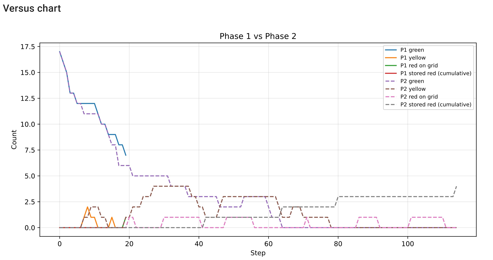

# Mission Robot MAS 2026 --- (Version V2 : Contamination)

Guillaume PORET
Christophe BOSHRA
Groupe 30

## 1. Vue d'ensemble du projet

Ce projet implémente un système multi-agents dans lequel des robots opèrent dans un environnement hostile afin de collecter, transformer et transporter des déchets radioactifs.

La **Version 2** introduit un système de **contamination** : les robots perdent des points de vie (résistance) lorsqu'ils transportent des déchets radioactifs. Plus le déchet est dangereux, plus les dégâts sont élevés. Lorsque la résistance d'un robot tombe à zéro, il est mis **KO** et doit retourner à sa **base** pour se régénérer.

L'environnement est divisé en trois zones :

- z1 : faible radioactivité, contient les déchets verts initiaux
- z2 : radioactivité moyenne
- z3 : forte radioactivité, inclut la zone de stockage

Chaîne de transformation des déchets :

vert → jaune → rouge → stockage

Les robots sont spécialisés :

- Robots verts : collectent les déchets verts et les transforment en jaunes
- Robots jaunes : collectent les déchets jaunes et les transforment en rouges
- Robots rouges : transportent les déchets rouges vers la zone de stockage

------------------------------------------------------------------------

## 2. Structure du projet

- agents.py : comportements des robots (patrouille, KO, contamination)
- model.py : environnement, logique de simulation et gestion de la résistance
- objects.py : objets passifs (déchets, radioactivité, zone de stockage)
- server.py : visualisation
- benchmark.py : évaluation des performances
- run.py : instructions de lancement

------------------------------------------------------------------------

## 3. Conception du modèle

### Environnement

L'environnement est une grille 2D définie par une largeur et une hauteur.

Les zones sont déterminées par l'indice de colonne :

- z1 : de x = 0 à z1_end
- z2 : de z1_end + 1 à z2_end
- z3 : colonnes restantes

Chaque cellule contient :
- un niveau de radioactivité
- éventuellement un déchet
- éventuellement des robots

### Paramètres

Les paramètres principaux sont :

- width, height : taille de la grille
- n_green_robots, n_yellow_robots, n_red_robots : nombre d'agents
- seed : graine aléatoire
- communication_enabled : active ou désactive la communication
- max_steps : limite de simulation
- n_initial_green_wastes : nombre de déchets initiaux

### Transformation des déchets

- 2 verts → 1 jaune
- 2 jaunes → 1 rouge
- rouge → stocké dans la zone de stockage

### Condition d'arrêt

La simulation s'arrête dans deux cas principaux :

1. l'objectif de la mission est atteint :

   `stored_red_waste >= expected_stored_red`

2. aucun progrès supplémentaire n'est possible, ou le nombre maximal de pas est atteint.

La quantité cible de déchets finaux stockés est calculée comme suit :

`expected_stored_red = initial_green_wastes // 4`

Cela provient de la chaîne de transformation implémentée dans le modèle :

- 2 déchets verts -> 1 déchet jaune
- 2 déchets jaunes -> 1 déchet rouge
- 1 déchet rouge -> stocké dans la zone de stockage

La condition d'arrêt ne se limite pas au critère de stockage final. Le modèle vérifie également si un progrès significatif est encore possible en inspectant :

- les déchets rouges déjà présents sur la grille ou dans les inventaires des robots
- les déchets jaunes encore disponibles
- les déchets verts encore disponibles
- si certains robots peuvent encore effectuer une transformation

Pour la version avec communication, le modèle inclut une courte fenêtre de tolérance sans progrès via `deadlock_patience`. Cela est nécessaire car les agents peuvent se coordonner et se débloquer grâce à la communication.

En particulier, les agents peuvent échanger des déchets intermédiaires via une zone tampon. Lorsque deux robots possèdent chacun un seul objet qui ne peut pas être transformé localement, ils peuvent se coordonner : un robot dépose son objet sur le buffer, et l'autre le récupère pour compléter une transformation. Ce mécanisme coopératif peut nécessiter plusieurs étapes sans progrès immédiat (pas de transformation ni de stockage), d'où la nécessité d'une tolérance avant d'arrêter la simulation.

Pour la version sans communication, cette tolérance est désactivée (`deadlock_patience = 0`). Comme les agents ne peuvent ni partager d'informations ni coordonner des échanges via le buffer, aucune stratégie de récupération n'existe une fois le système bloqué. La simulation s'arrête donc dès qu'aucun progrès supplémentaire n'est possible dans l'état courant.

Lorsque la simulation se termine à cause d'un tel blocage (plus aucun progrès atteignable), le nombre final de pas est fixé à `max_steps` afin de rendre les résultats comparables entre les exécutions.

### Détection de deadlock irréversible (V2)

La V2 introduit un cas de deadlock spécifique à la contamination : lorsqu'un **robot jaune tombe KO en transportant un déchet rouge** en Phase 1 (sans communication), le déchet est lâché dans une zone inaccessible pour les robots rouges (qui ne savent pas qu'il existe). Le modèle détecte cette situation et marque `irreversible_deadlock = True`, ce qui termine immédiatement la simulation. Ce mécanisme est désactivé en Phase 2, car le broadcast KO permet aux robots rouges d'être alertés.

### Suivi de la progression (`_mark_progress`)

Chaque action matérielle (ramassage, transformation, stockage) met à jour `last_progress_step`. La différence `step_count - last_progress_step` est comparée à `deadlock_patience` (25 steps en Phase 2, 0 en Phase 1) pour détecter un blocage sans progrès.

------------------------------------------------------------------------

## 4. Système de contamination

### Principe

Les déchets radioactifs transportés par les robots provoquent une **contamination continue**. À chaque pas de simulation, un robot portant des déchets perd des points de résistance proportionnellement au nombre d'objets dans son inventaire et à son profil de dégâts.

La formule de dégâts est :

```
dégâts = nombre_objets_inventaire × dégâts_par_objet_par_step
```

### Profils de résistance par type de robot

| Type de robot | Résistance max | Dégâts par objet par step |
|---------------|---------------|--------------------------|
| Vert          | 18 HP         | 1 HP                     |
| Jaune         | 20 HP         | 2 HP                     |
| Rouge         | 25 HP         | 3 HP                     |

Les robots rouges subissent les dégâts les plus élevés car ils manipulent les déchets les plus radioactifs (rouges), mais disposent aussi de la résistance maximale la plus élevée.

### Régénération naturelle

Lorsqu'un robot n'a **aucun objet dans son inventaire** et qu'il n'est **pas à sa base**, il régénère **1 HP par step**, jusqu'à retrouver sa résistance maximale.

### État KO (Knock-Out)

Lorsque la résistance d'un robot tombe à **0** :

1. Le robot passe en état **KO**
2. Il **lâche tout son inventaire** à sa position actuelle
3. Il doit **retourner à sa base** pour récupérer
4. Il ne peut effectuer **aucune action normale** tant qu'il est KO (pas de ramassage, pas de transformation, pas de communication)
5. Le passage en KO génère un **broadcast** signalant la position des déchets lâchés (avec un TTL étendu de 60 steps contre 20 pour les rapports normaux)

### Bases de régénération

Chaque type de robot possède une **base** positionnée sur la dernière ligne de la grille (y = height - 1) :

| Type de robot | Position de la base       |
|---------------|--------------------------|
| Vert          | (0, height - 1)           |
| Jaune         | (z1_end, height - 1)      |
| Rouge         | (z2_end, height - 1)      |

Lorsqu'un robot atteint sa base :

- **Soin instantané** : la résistance est restaurée au maximum, même si le robot n'est pas KO
- **Récupération KO** : un robot KO arrivé à sa base doit attendre **5 steps** supplémentaires avant de reprendre ses activités normales. Pendant ce temps, il décrémente son compteur `ko_remaining_steps` à chaque step. Son état KO est levé lorsque ce compteur atteint 0.

### Ordre d'application de la résistance

La mise à jour de la résistance est appliquée **après chaque action d'agent** dans le step, selon la logique suivante :

1. Si le robot est **à sa base** → soin instantané (résistance = max). Si KO, décrémente `ko_remaining_steps` ; lève l'état KO quand le compteur atteint 0.
2. Si le robot est **KO mais pas encore à sa base** → aucune régénération, aucune action possible (seul le déplacement vers la base est autorisé).
3. Si le robot est **normal, hors base, avec inventaire** → subit les dégâts.
4. Si le robot est **normal, hors base, inventaire vide** → régénération naturelle (+1 HP/step).
5. Si la résistance tombe à **0 ou moins** → passage en KO, drop de l'inventaire, libération des claims et tâches KO assignées.

### File de tâches KO (`ko_recovery_queue`)

Lorsqu'un robot lâche des déchets en devenant KO, une **tâche de récupération** est créée dans la file `ko_recovery_queue`, organisée par type de déchet. Chaque tâche contient :

- `task_id` : identifiant unique
- `waste_type` : type de déchet lâché
- `position` : coordonnées du drop
- `created_at` : step de création
- `assigned_to` : id du robot qui a réclamé la tâche (ou `None`)
- `reporter_id` : id du robot KO

Les robots du même type consultent cette file dans leur délibération. La sélection de la meilleure tâche KO (`_best_ko_task`) suit cet ordre de priorité :

1. **Tâche déjà assignée au robot** (priorité maximale pour maintenir la cohérence)
2. **Tâche libre** (`assigned_to = None`), triée par ancienneté puis par distance Manhattan

Un robot peut **réclamer** une tâche (`_claim_ko_task`), et la tâche est **résolue** automatiquement lorsqu'il n'y a plus de déchet du type concerné à la position indiquée.

Le nettoyage de la file (`_cleanup_ko_queue`) supprime les tâches résolues et libère les tâches dont le robot assigné a disparu de l'état partagé (TTL expiré).

### Deadlock irréversible (Phase 1)

En Phase 1 (sans communication), un cas de deadlock irréversible est détecté : si un **robot jaune tombe KO en portant un déchet rouge**, ce déchet est lâché dans z1 ou z2. Sans communication, aucun robot rouge ne peut être alerté de sa position, rendant la progression impossible. Le modèle marque alors `irreversible_deadlock = True` et la simulation s'arrête immédiatement.

### Boucle de simulation (step)

À chaque pas de simulation, l'ordre d'exécution est :

1. **Mélange aléatoire** de l'ordre des agents (`random.shuffle`)
2. Pour chaque agent :
   a. Perception → mise à jour des connaissances → délibération → exécution de l'action
   b. **Mise à jour de la résistance** (dégâts, régénération, passage en KO)
3. **Nettoyage** de l'état partagé (rapports expirés, claims expirés, file KO)
4. **Enregistrement** de l'historique (compteurs de déchets, stockage, messages)
5. **Vérification** de la condition d'arrêt

L'action bundle retourné par la délibération de chaque agent contient :
- `main` : l'action principale (move, pick, transform, drop, wait)
- `reports` : rapports de déchets à publier
- `status_reports` : état du robot à diffuser
- `claim` : revendication d'une cible
- `ko_claim` : réclamation d'une tâche KO

Lorsqu'un agent est KO, ses rapports, status_reports, claims et ko_claims sont ignorés. Seule l'action principale (déplacement vers la base) est exécutée.

------------------------------------------------------------------------

## 5. Conception des agents

### Architecture des agents

Chaque agent suit une boucle :

1. Perception
2. Mise à jour des connaissances
3. Délibération
4. Exécution de l'action

Les agents maintiennent une structure de connaissances locale incluant :

- position actuelle
- inventaire
- cellules visibles
- déchets connus
- cibles partagées
- revendications (claims)
- états des robots
- **résistance actuelle, état KO, position de la base**

### Gestion de la contamination dans la délibération

À chaque step, avant de décider de son action, un agent prend en compte sa résistance :

- **Si KO** : l'agent se déplace uniquement vers sa base (aucune autre action possible)
- **Si la résistance est basse** : l'agent peut choisir de retourner à sa base pour se soigner avant de continuer sa mission
- **Si en bonne santé** : comportement normal (collecte, transformation, patrouille)

------------------------------------------------------------------------

### Agent vert

Responsabilités :

- collecter les déchets verts
- transformer en jaunes
- déplacer les déchets jaunes vers la frontière de z1

Zones autorisées : z1 uniquement.

Délibération (ordre de priorité) :

1. **KO** → retour à la base (0, height-1)
2. **Jaune en inventaire** → déplacement vers z1_end puis drop (passage de relais aux jaunes)
3. **2 verts en inventaire** → transformation (2 verts → 1 jaune)
4. **Déchet vert sur la case courante** → ramassage
5. **Échange coopératif** → si 1 seul vert en inventaire et aucune cible connue, rendez-vous au buffer avec un partenaire vert
6. **Cible connue** → déplacement vers la meilleure cible non revendiquée (locale ou partagée)
7. **Patrouille rectangulaire** → parcours structuré dans z1, divisé en 3 bandes horizontales (une par robot vert), avec sens alterné (horaire/antihoraire)

---

### Agent jaune

Responsabilités :

- collecter les déchets jaunes
- transformer en rouges
- déplacer les déchets rouges vers la frontière de z2

Zones autorisées : z1 et z2.

Délibération (ordre de priorité) :

1. **KO** → retour à la base (z1_end, height-1)
2. **Rouge en inventaire** → déplacement vers z2_end puis drop (passage de relais aux rouges)
3. **2 jaunes en inventaire** → transformation (2 jaunes → 1 rouge)
4. **Déchet jaune sur la case courante** → ramassage
5. **Échange coopératif** → si 1 seul jaune en inventaire et aucune cible connue, rendez-vous au buffer avec un partenaire jaune
6. **Tâche KO disponible** → récupération prioritaire des déchets jaunes lâchés par un robot KO (via `ko_recovery_queue`)
7. **Cible connue** → déplacement vers la meilleure cible non revendiquée
8. **Patrouille frontière** → mouvement vertical le long de z1_end, avec rebond aux bords et sens initial alterné par id

---

### Agent rouge

Responsabilités :

- collecter les déchets rouges
- transporter vers la zone de stockage (disposal zone)

Zones autorisées : z1, z2, z3 (toute la grille).

Délibération (ordre de priorité) :

1. **KO** → retour à la base (z2_end, height-1)
2. **Rouge en inventaire + sur la zone de stockage** → drop (stockage final)
3. **Rouge en inventaire** → déplacement direct vers la zone de stockage
4. **Déchet rouge sur la case courante** → ramassage
5. **Tâche KO disponible** → récupération prioritaire des déchets rouges lâchés par un robot KO (via `ko_recovery_queue`)
6. **Cible connue** → déplacement vers la meilleure cible non revendiquée
7. **Patrouille frontière** → mouvement vertical le long de z2_end, avec rebond aux bords

------------------------------------------------------------------------

## 6. Système de communication

La communication est contrôlée par un paramètre booléen (`communication_enabled`).

Lorsqu'elle est activée, les agents ne diffusent pas globalement sans structure. La communication est organisée par type de déchet et type de robot, et chaque agent ne reçoit que les informations pertinentes pour son rôle.

---

### Communication filtrée par type

La communication n'est ni globale ni symétrique entre tous les agents. Elle est structurée à la fois par type de robot et par la chaîne de transformation.

Chaque agent partage des informations sur :

- son type de déchet cible (tâche principale)
- le type de déchet suivant dans la chaîne de transformation (pour aider les agents en aval)

Plus précisément :

- agents verts :
  - partagent des informations sur les déchets verts
  - signalent aussi les déchets jaunes

- agents jaunes :
  - partagent des informations sur les déchets jaunes
  - signalent aussi les déchets rouges

- agents rouges :
  - se concentrent uniquement sur les déchets rouges

Cependant, au moment de la perception, chaque agent ne reçoit que les informations pertinentes pour son type :

- agents verts → déchets verts
- agents jaunes → déchets jaunes
- agents rouges → déchets rouges

Flux d'information :

vert → jaune → rouge

---

### Carte partagée (rapports de déchets)

Les agents publient des observations sur les déchets visibles.

Chaque rapport contient :

- type de déchet
- position
- distance (depuis l'agent)
- priorité
- timestamp (last_seen)
- id du robot
- **source** : `"normal"` ou `"ko_drop"` (les rapports KO ont un TTL étendu de 60 steps)

Structure :

shared_map[waste_type][position] → report

Les rapports sont mis à jour en continu et supprimés après une durée de vie (TTL) :
- **Rapports normaux** : TTL = 20 steps
- **Rapports KO** : TTL = 60 steps (3× plus long, car les déchets lâchés par un robot KO sont prioritaires à récupérer)

---

### Claims (éviter les conflits)

Les agents peuvent réserver une cible avant de s'y déplacer.

Chaque claim contient :

- id du robot
- timestamp

claims[waste_type][position] → {robot_id, step}

Règles :

- un robot évite les cibles déjà revendiquées
- les claims expirent après 8 steps
- ils sont libérés si la ressource disparaît

---

### Partage d'état des robots

Les agents diffusent :

- position
- nombre d'objets

shared_robot_state[robot_type][robot_id] → état

---

### Échange coopératif via buffer

Un mécanisme de coordination est implémenté via une position buffer située aux frontières des zones.

Positions des buffers :
- Buffer vert : (z1_end, height // 2)
- Buffer jaune : (z2_end, height // 2)

Déclenchement :

- un robot possède exactement un objet
- aucun objectif compatible connu
- communication activée

Processus :

1. identification d'un partenaire du même type ayant aussi 1 objet
2. tri par id (id inférieur = donneur, id supérieur = receveur)
3. dépôt sur le buffer par le donneur
4. récupération par le receveur
5. transformation possible (2 objets réunis)

Contraintes :

- un seul objet sur le buffer
- gestion de claims
- attente si occupé

---

### Broadcast KO

Lorsqu'un robot tombe KO, un message spécial est diffusé contenant :

- la position où les déchets ont été lâchés
- le type de déchets concernés
- un TTL étendu (60 steps)

Ce broadcast permet aux autres robots de localiser et récupérer les déchets abandonnés, limitant ainsi la perte de progression causée par la contamination.

---

### Sélection de cible (`_best_unclaimed_target`)

Lorsqu'un agent cherche un déchet à collecter, il combine deux sources d'information :

1. **Connaissances locales** (`known_wastes`) : les déchets vus directement par le robot
2. **Carte partagée** (`shared_targets`) : les rapports publiés par les autres robots

Les cibles déjà revendiquées par un autre robot (via claims) sont exclues. Le score de chaque cible est calculé comme :

```
score = distance_manhattan - (2 × priorité)
```

La cible avec le score le plus bas est sélectionnée. Les rapports KO ayant une priorité de 10 sont donc fortement favorisés (score réduit de 20).

---

### Coût des messages

Chaque publication (rapport, claim, statut) qui **diffère de l'état précédent** incrémente le compteur global `message_count`. Les publications identiques à l'état déjà enregistré ne sont pas comptées.

------------------------------------------------------------------------

## 7. Conception du benchmark

Les simulations sont exécutées sous deux configurations :

- Phase 1 : communication désactivée
- Phase 2 : communication activée

Les deux phases utilisent les mêmes graines et conditions initiales.

Les simulations sont réalisées avec les paramètres suivants :
width=18, height=8, 3 robots verts, 2 jaunes, 2 rouges, max_steps=250.

Un total de 30 simulations indépendantes est effectué pour chaque phase.

Mesures collectées :

- nombre de pas
- déchets rouges stockés
- taux de complétion
- efficacité
- nombre de messages
- taux de succès

------------------------------------------------------------------------

## 8. Résultats

| Metric              | Phase 1 (sans communication) | Phase 2 (avec communication) |
|--------------------|-----------------------------|------------------------------|
| Average steps      | 250.00                      | 113.10                       |
| Stored red waste   | 0.00                        | 3.87                         |
| Completion ratio   | 0.0000                      | 1.0000                       |
| Efficiency         | 0.000000                    | 0.034250                     |
| Success rate       | 0%                          | 100%                         |
| Messages           | 0                           | 810.47                       |

---

### Description des métriques

- **Average steps**
  Nombre moyen de pas avant arrêt (succès ou deadlock)

- **Stored red waste**
  Nombre moyen de déchets rouges stockés

- **Completion ratio**
  `stocké / attendu`

- **Efficiency**
  `stocké / pas`

- **Success rate**
  Pourcentage de réussite

- **Messages**
  Nombre moyen de messages

---

### Observations

- **La Phase 1 (sans communication) est totalement non fonctionnelle en V2** : 0% de succès, 0 déchet stocké. L'ajout de la contamination rend la coordination implicite insuffisante. Lorsqu'un robot jaune tombe KO en portant un déchet rouge, celui-ci est lâché sans qu'aucun robot rouge ne puisse en être informé, provoquant un deadlock irréversible. Ce phénomène se produit systématiquement sur les 30 runs.
- **La Phase 2 (avec communication) atteint 100% de succès** avec un completion ratio parfait de 1.0. La communication permet de récupérer les déchets lâchés par les robots KO grâce aux broadcasts KO et à la file de tâches de récupération.
- **L'écart entre les deux phases est radical** : la communication n'est plus un simple avantage comme en V1 (70% → 96.7%), elle est devenue **indispensable** en V2 (0% → 100%).
- Le coût en messages (810 en moyenne) est plus élevé qu'en V1 (648), en raison des broadcasts KO supplémentaires et de la coordination accrue nécessaire.
- L'efficacité en Phase 2 (0.034) est inférieure à celle de la V1 (0.054), ce qui reflète le surcoût temporel lié aux retours à la base pour régénération et aux périodes d'inactivité KO.

------------------------------------------------------------------------

## 9. Visualisation de la simulation

### Capture de la simulation


- cellules vertes, jaunes, rouges : zones z1, z2, z3
- robots G, Y, R : agents verts, jaunes, rouges
- déchets g, y, r : déchets correspondants
- D : zone de stockage
- Bases de régénération sur la dernière ligne

---

### Graphique dynamique



Suivi :

- déchets verts sur la grille
- déchets jaunes sur la grille
- déchets rouges sur la grille
- stockage cumulé de déchets rouges

---

### Comportement observé

- La Phase 1 stagne rapidement : les robots tombent KO et les déchets lâchés ne sont jamais récupérés
- La Phase 2 montre une progression régulière grâce à la coordination
- Les robots retournent à leur base pour se régénérer, puis reprennent leur mission
- Les déchets lâchés par les robots KO sont récupérés grâce aux broadcasts et à la file de tâches KO

------------------------------------------------------------------------

## 10. Lancement du projet

python run.py
